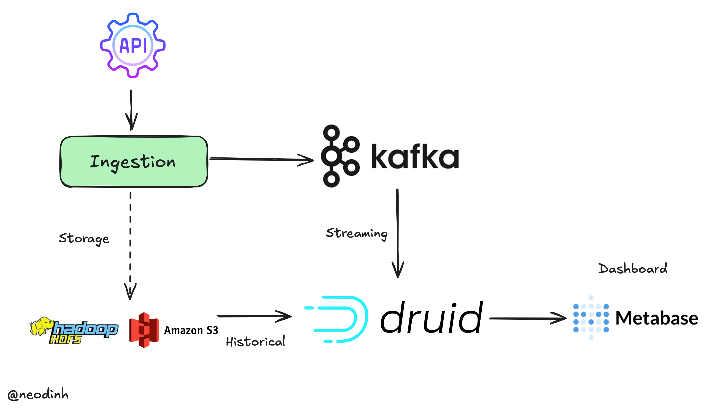
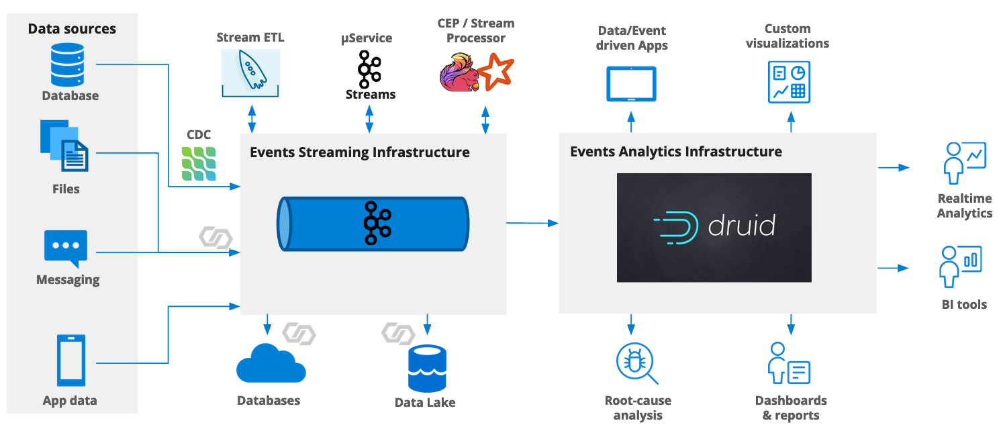
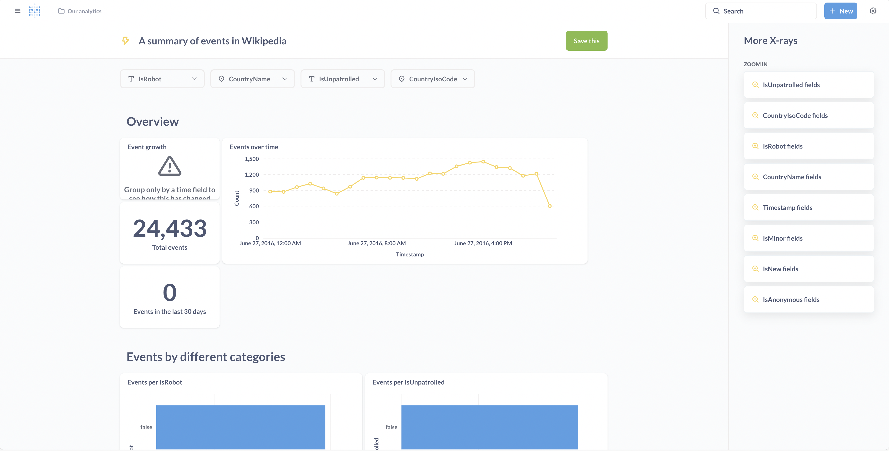
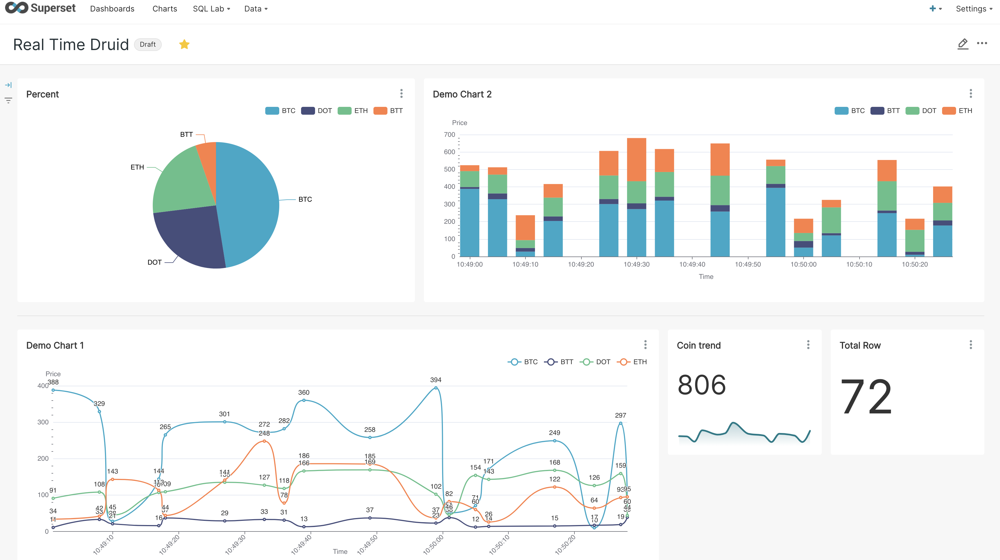
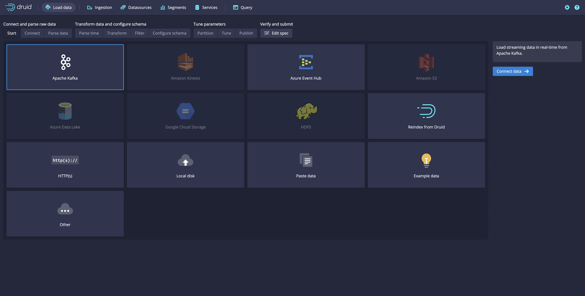
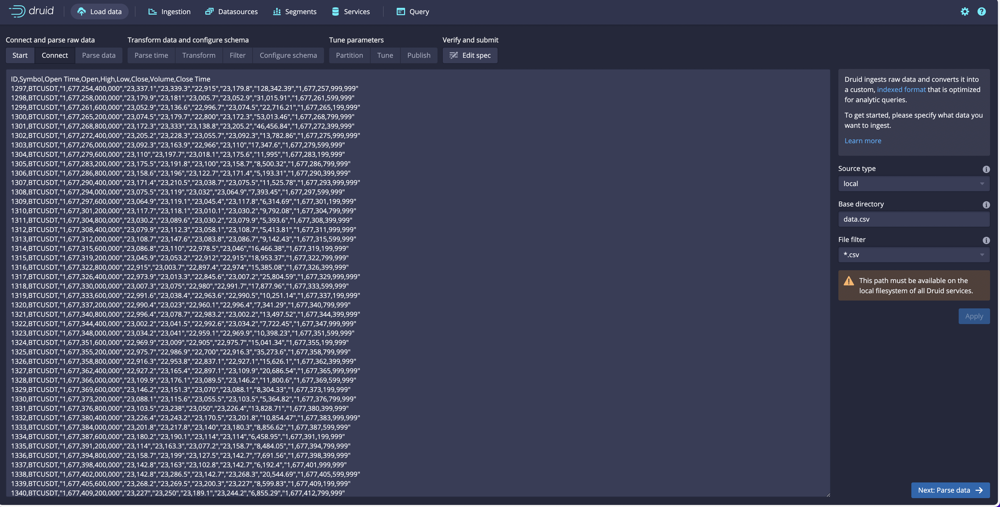
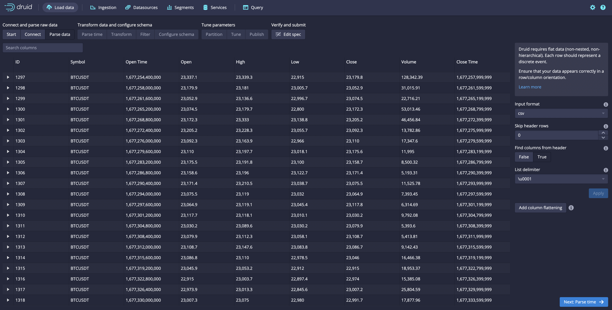

# RealTime Analytic Platform With Druid - Airflow - Kafka - Metabase - Superset - PostgreSQL

[](https://kafka.apache.org/documentation/)
[](https://druid.apache.org/docs/latest/design/)
[](https://www.postgresql.org/)
[](https://www.metabase.com/docs/latest/dashboards/start)
[](https://superset.apache.org/docs/intro/)
[](https://airflow.apache.org/docs/)
[](https://redis.io/)

This repo gives an introduction to setting up streaming analytics using open source technologies. We'll use Apache {Kafka, Druid, Airflow} and Visualize tool {Metabase or Superset} to set up a system that allows you to get a deeper understanding of the behaviour of your customers. [Apache Druid](https://github.com/apache/druid)

## DataFlow

- This project uses Docker Compose to orchestrate a multi-container environment for a data analytics platform. The setup includes PostgreSQL, Apache Druid, Kafka, Metabase, Superset, Airflow, and Redis, each running in separate containers.

**View System**



### What is Druid?

Druid is an open-source analytics data store designed for business intelligence (OLAP) queries on event data. Druid provides low latency (real-time) data ingestion, flexible data exploration, and fast data aggregation. Existing Druid deployments have scaled to trillions of events and petabytes of data. Druid is most commonly used to power user-facing analytic applications.

```bash
The compose file will launch :
- 1 zookeeper node
- 1 postgres database

and the following druid services :
- 1 broker
- 1 overlord
- 1 middlemanager
- 1 historical
- 1 historical
```

> The image contains the full druid distribution and use the default druid cli. If no command is provided the image will run as a broker.
> If you plan to use this image on your local machine, be careful with the JVM heap spaces required by default (some services are launched with 15gb heap space).

### Getting Started

- Clone the repository
- Navigate to the project directory
- Run docker-compose up -d to start all services: `cd realtime-analytic-platform && docker-compose up`

We are using Druid with mode `micro-quickstart` is sized for small machines like laptops and is intended for quick evaluation use-cases.
[For more detail](https://druid.apache.org/docs/latest/operations/single-server/#single-server-reference-configurations-deprecated)

**Usage**

- Access PostgreSQL on port 5432.
- Access Zookeeper on port 2181.
  Access Druid services on respective ports (8081 for Coordinator, 8082 for - Broker, etc.).
- Access Kafka on port 9094.
- Access Kafka UI on port 9080.
- Access Metabase on port 3000.
- Access Superset on port 3088.
- Access Airflow on port 3080.

|        Service        |          URL           |                 User/Password                  |
| :-------------------: | :--------------------: | :--------------------------------------------: |
| Druid Unified Console | http://localhost:8098/ |                      None                      |
| Druid Legacy Console  | http://localhost:8081/ |                      None                      |
|       Superset        | http://localhost:3088/ |  docker exec -it superset bash superset-init   |
|       Metabase        | http://localhost:3000/ |                      None                      |
|        Airflow        | http://localhost:3000/ | data_airflow/app/standalone_admin_password.txt |

### Run Airflow And Produce to Kafka

- Airflow dags at app_airflow/app/dags/demo.py each one min sent message to kafka 'demo' topic with data of list coin ['BTC', 'ETH', 'BTT', 'DOT'] the structure of data message like below.

```
   {
        "data_id" : 454,
        "name": 'BTC',
        "timestamp": '2024-02-05T10:10:01'
    }
```

- Or using python script to produce data into Kafka. `python3 ./scripts/producer.py`

### Druid Data Lake Streaming

- From druid load data from kafka `kafka:9092`, choice `demo` topic and config data result table
- Or using example data from Druid Load Data.
  

  

### Metabase Visualize Tool

- From Metabase add Druid like database uri: `http://broker:8082` more detail at [Metabase-Database-Connect](https://www.metabase.com/docs/latest/databases/connections/druid)
- Create Chart and dashboard on metabase from `demo` table.
- Enjoy!
  

### Superset Visualize Tool

- From Superset add druid like database sqlalchemy uri: `druid://broker:8082/druid/v2/sql/` more detail at [Superset-Database-Connect](https://superset.apache.org/docs/databases/db-connection-ui)
- Create Chart and dashboard on superset from `demo` table.
- Enjoy!
  

### Screenshots







# License

This project is licensed under the MIT License. See the LICENSE file for more details.
